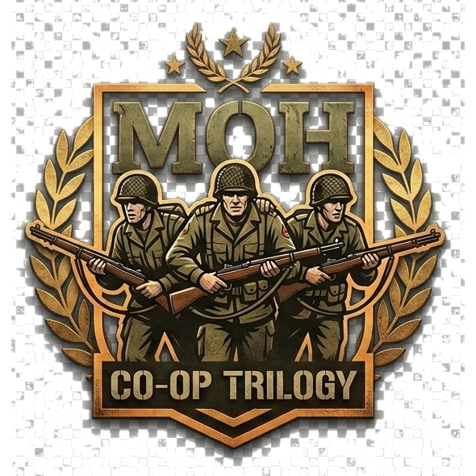

# MOH Coop Trilogy

Play **Medal of Honor: Allied Assault War Chest** cooperatively — the complete *Allied Assault*, *Spearhead*, and *Breakthrough* campaigns, mission by mission, with up to 8 players.

Built on the [HaZardModding Coop Mod](https://github.com/HaZardModding/hzm-mohaa-coop-mod) by chrissstrahl and a custom fork of the [OpenMOHAA](https://github.com/openmoh/openmohaa) engine, then heavily extended: modern movement and gunplay, a full audio overhaul, HD visuals with post-processing on the classic renderer, and dozens of coop-specific systems. One installer, automatic updates at every launch, and your original game folder is never touched.

> [!WARNING]
> **Early alpha.** This project is under heavy active development: expect bugs, rough edges, and
> frequent updates. When something breaks, please report it — either through the built-in
> **Start menu -> "MOH Trilogy Coop - Report a Problem"** tool (one click, sends your logs straight
> to the dev team) or by [opening an issue](https://github.com/MOHCoopTrilogy/releases/issues).
> Bug reports are the single most helpful thing you can do for the project right now.

**[Download the latest release →](https://github.com/MOHCoopTrilogy/releases/releases/latest)**

| Repo | What it holds |
|---|---|
| [MOHCoopTrilogy/releases](https://github.com/MOHCoopTrilogy/releases) | This repo — downloads, the auto-update manifest, build & installer pipeline |
| [MOHCoopTrilogy/hzm-mohaa-coop-mod](https://github.com/MOHCoopTrilogy/hzm-mohaa-coop-mod) | Mod source (scripts, UI, configs, assets) |
| [MOHCoopTrilogy/openmohaa](https://github.com/MOHCoopTrilogy/openmohaa) | Engine fork source (GPLv2) |

## Requirements

- A GOG installation of [Medal of Honor: Allied Assault War Chest](https://www.gog.com/game/medal_of_honor_allied_assault_war_chest)
- Windows, and roughly 6 GB of free disk space

That's the whole list. The engine, renderer, runtimes, and all mod content are bundled. The installer detects your GOG install automatically and reads the original game data from it **without modifying it** — everything installs side-by-side into its own folder, so your vanilla game keeps working exactly as before.

## Install

1. Go to [Releases](https://github.com/MOHCoopTrilogy/releases/releases/latest) and download the latest `MOHCoopTrilogy-Setup-<version>.exe` **together with all of its `.bin` parts** (the payload is split into ~2 GB slices — the exe needs them next to it).
2. Keep the exe and the `.bin` files in the same folder and run the exe.
3. Launch the game through the **MOH Trilogy Coop** shortcut (desktop or Start menu). Every launch quietly checks for updates and downloads only what changed — typically a few megabytes. If the check fails for any reason, the game simply starts with what you have; updates never block play.

**Already on a 1.0.x test build?** Grab the small `MOHCoop-Upgrade` zip from Releases instead of the full setup — after that one patch, the auto-updater keeps you current.

**Something broke?** Start menu → **MOH Trilogy Coop – Report a Problem** collects your logs and system info and sends them to us in a couple of clicks. GitHub [Issues](https://github.com/MOHCoopTrilogy/releases/issues) work too.

### Playing

Host: launch the shortcut, then **Multiplayer → Start Game → HaZardModding Coop Mod**, pick a mission tile, hit Apply. Friends join over LAN/Internet via **Multiplayer → Join Game** or `connect <ip>` in the console.

## Features

### Full-campaign co-op

- All three War Chest campaigns playable start to finish in coop — 50+ missions with working objectives, cutscene moments, escorts, and vehicle rides
- Objectives HUD with main and side objectives, mission-progress respawn points, and map-to-map transitions
- **Down-But-Not-Out**: instead of dying you go down — crawl, hold on (heartbeat and breathing close in), and self-revive with a medkit, or bleed out
- Optional **Last Man Standing** mode with a shared pool of lives
- AI difficulty and enemy counts scale with how many players are in — more players means more Germans, within sane caps
- **Officer boss encounters**: named officers with reinforcement waves, death battalions, German voice lines, and heal-and-retreat behavior
- **Reward items** from officer kills: binoculars that call in airstrikes, and signal smoke that summons a C-47 supply paradrop — including an AI medic who can get downed players back up
- Server-tunable rules via cvars: player health, DBNO on/off, LMS lives, corpse persistence, and more

### Combat & movement

- **Aim-down-sights** on right mouse, individually tuned for 24 weapons
- **Sprint & stamina** — weapon lowers, gear rattles, stamina drains and recovers; walk quietly on ALT
- Weapon **bash** on its own key, plus lean
- Deployable **ammo box** and **sandbag cover** anyone on the team can use
- **MG42 overheat** on mounted guns
- **Corpse impact physics** — explosions actually throw bodies
- **Blood trails** from wounded enemies you can follow
- **Suppression**: near misses desaturate and tighten your view
- **Tinnitus** and muffled hearing after close explosions
- **Death voices**: a 334-scream pool with distance filtering — far-away kills sound far away
- Headshot kill audio cue

### Audio overhaul

- Every weapon re-voiced — gun sounds redesigned from professionally recorded, licensed sound libraries
- **Environmental reverb**: interiors classify themselves (room, stone hall, bunker) and gunfire reverberates to match
- **Sound occlusion** — fights on the other side of a wall sound like they're on the other side of a wall
- **HRTF** 3D audio for headphone users
- **Distance layering**: distant gunfire gets true far-field tails instead of the same close-up bark
- Full in-game **audio mixer**: Master, Music, SFX, Ambience, and Dialogue sliders, plus an **output-device picker**
- Per-map ambience beds and dynamic weather you can hear roll in
- Battle-aware ducking so big scripted moments read clearly over the noise

### Visuals

- Bundled **HD texture, character, world, FX, and skybox packs** (see credits), wired through a DDS override pipeline so the HD versions load reliably everywhere
- Post-processing on the classic renderer: **bloom**, **contrast-adaptive sharpening**, and suppression/low-health screen effects
- Decal **shadows** under characters
- Overhead **teammate icons** so you stop shooting your friends
- **Dynamic weather** — rolling rainstorms driven through the engine's native weather system
- Full-detail models at all distances

### Quality of life

- One-click installer, side-by-side with your GOG install — nothing in the game folder is ever modified
- **Automatic updates** at launch, usually only a few MB
- In-game coop settings hub plus rebuilt audio/video options
- Bindable coop commands (drop ammo box, objectives, coop actions)
- Objectives recap toggle on a key
- **Report a Problem** tool in the Start menu

## Roadmap

In design and research — being built in the open, no dates promised:

- **XP & skill trees** — persistent per-player XP earned across the campaign, spent in three trees: **Ranger** (assault), **Corpsman** (medic/support — reviving teammates is planned as a Corpsman unlock), and **Pathfinder** (recon/officer hunting)
- **Carryable machine guns** — the portable MG42 (carry it, deploy it on its bipod/tripod, pack it back up) as an equippable loadout option, later as map pickups and enemy MG teams; a .30 cal variant to follow
- **In-game update notifications** — an "update available" notice in the menu when a release lands while you're playing

## Credits

This project stands on a lot of other people's work. Thank you:

- **chrissstrahl, Smithy (1337Smithy), and HaZardModding** — creators of the original [HZM Coop Mod](https://github.com/HaZardModding/hzm-mohaa-coop-mod), the coop framework this entire project builds on, plus the HZM testers and community ([hazardmodding.com](http://www.hazardmodding.com))
- **The OpenMOHAA team** — the open-source [engine](https://github.com/openmoh/openmohaa) that makes any of this possible
- **HD content packs**, bundled with attribution to their authors:
  - *MOHAA HD Project* (AA HD Project paks)
  - *HRRTM — HD Realism Texture Mod* (texture, model, and weapon paks plus the blood-effects addon)
  - HD gun sounds, geared soldiers, and HD foliage packs by their respective authors
  - Additional in-house upscale and gap-fill packs (character skins, world, FX, skybox, DDS overrides) produced for this project
- **Sound design** — additional weapon and world audio built from licensed professional sound libraries
- **2015, Inc. / Electronic Arts** — the original *Medal of Honor: Allied Assault* trilogy

*MOH Coop Trilogy is an independent, non-commercial fan project. It is not affiliated with, endorsed by, or sponsored by Electronic Arts, 2015 Inc., or any other rights holder of the Medal of Honor series. Medal of Honor and all related trademarks and assets remain the property of their respective owners. A legitimate copy of the original game is required to play.*

## License

- **Engine fork** — GPLv2, source at [MOHCoopTrilogy/openmohaa](https://github.com/MOHCoopTrilogy/openmohaa) (upstream: [openmoh/openmohaa](https://github.com/openmoh/openmohaa))
- **Mod scripts and content** — under the original HZM Coop Mod's terms; see `hzm_legal.txt` in the [mod repo](https://github.com/MOHCoopTrilogy/hzm-mohaa-coop-mod)
- **Game assets** — remain the property of their respective owners and are not covered by the above

## Feedback

Found a bug, or something just feels off? Use the **Report a Problem** tool in the Start menu (it attaches the logs we need), or open an issue on [this repo](https://github.com/MOHCoopTrilogy/releases/issues). Mission-breaking bugs in any of the 50+ maps are the highest priority — tell us the map and what you were doing.

---

*About this repo: alongside Releases, it hosts the project pipeline — `build.ps1` (packs the mod tree into pk3s and deploys a dev install), `installer/` (Inno Setup sources + the problem reporter), `updater/` (the launch-time auto-updater), and `publish_release.ps1` (manifest generation and release publishing).*
