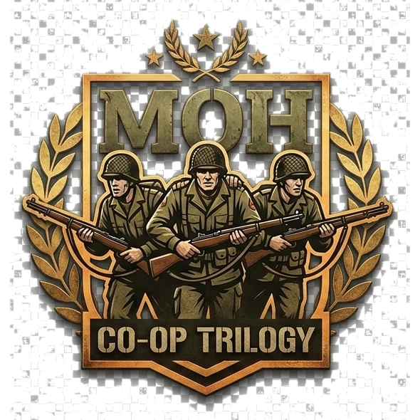

# MOH Coop Trilogy

> *The MOH Trilogy Coop Mod is a love letter to the early Medal of Honor franchise.*

Play **Medal of Honor: Allied Assault War Chest** cooperatively — the complete *Allied Assault*, *Spearhead*, and *Breakthrough* campaigns, mission by mission, with up to 16 players (4 players for the true experience).

Built on the [HaZardModding Coop Mod](https://github.com/HaZardModding/hzm-mohaa-coop-mod) by chrissstrahl and a custom fork of the [OpenMOHAA](https://github.com/openmoh/openmohaa) engine, then heavily extended: guns with real weight and recoil character, ragdoll physics, an unlockable Armory with hundreds of weapon finishes, enemies that take cover and fight back, a full audio overhaul, HD visuals with post-processing, and dozens of coop-specific systems. One installer, automatic updates at every launch, and your original game folder is never touched.

> [!CAUTION]
> **Not yet playtested end to end. Try it at your own risk.** Individual systems and missions get
> live playtests as they are built — v1.4.1 itself shipped after a live tuning pass — but neither a
> full multiplayer session nor a complete campaign run has been played through start to finish on
> the current build, and a large share of shipped systems have not yet been confirmed in real play.
> Expect to hit things nobody has hit yet. If you do, the Report a Problem tool below is genuinely
> the most useful thing you can send us.
>
> **Developer and debug tools are still switched on.** They were left in deliberately so testers
> can get unstuck, and they have not been stripped for release. With `coop_dev 1` set you get
> `noclip`, `god`, self-heal and heal-friendly, spawn-point inspection and marker placement,
> position printing, a touched-entity probe, threat-bias toggling, mission-status dumps, and the
> ability to fire an arbitrary script thread or trigger by name. Build mode (`coop_build`) lets you
> place and save world objects live, and the map tester (`coop_maptest`) drives an automated tour
> of every map. None of this is hidden behind anti-cheat, so on a public server treat it as an
> honour system.

> [!WARNING]
> **Early alpha.** This project is under heavy active development: expect bugs, rough edges, and
> frequent updates. When something breaks, please report it — either through the built-in
> **Start menu -> "MOH Trilogy Coop - Report a Problem"** tool (one click, sends your logs straight
> to the dev team) or by [opening an issue](https://github.com/MOHCoopTrilogy/releases/issues).
> Bug reports are the single most helpful thing you can do for the project right now.

**[⬇ Download & install (exactly which files) →](#what-to-download)**  |  **[Latest release notes →](https://github.com/MOHCoopTrilogy/releases/releases/latest)**  |  **[Join our Discord →](https://discord.gg/Br9FDB3KU)** — release announcements, find people to play with, report bugs, follow development

| Repo | What it holds |
|---|---|
| [MOHCoopTrilogy/releases](https://github.com/MOHCoopTrilogy/releases) | This repo — downloads, the auto-update manifest, build & installer pipeline |
| [MOHCoopTrilogy/hzm-mohaa-coop-mod](https://github.com/MOHCoopTrilogy/hzm-mohaa-coop-mod) | Mod source (scripts, UI, configs, assets) |
| [MOHCoopTrilogy/openmohaa](https://github.com/MOHCoopTrilogy/openmohaa) | Engine fork source (GPLv2) |

## Requirements

- A GOG installation of [Medal of Honor: Allied Assault War Chest](https://www.gog.com/game/medal_of_honor_allied_assault_war_chest)
- Windows, and roughly 6 GB of free disk space

That's the whole list. The engine, renderer, runtimes, and all mod content are bundled. The installer detects your GOG install automatically and reads the original game data from it **without modifying it** — everything installs side-by-side into its own folder, so your vanilla game keeps working exactly as before.

## Install

> [!NOTE]
> **It will not touch your existing game.** The mod installs into its own folder
> (`%LOCALAPPDATA%\MOH Coop Trilogy`) and runs from there. Your GOG *Medal of Honor: Allied
> Assault War Chest* install and any vanilla OpenMOHAA install are left exactly as they are —
> nothing is overwritten, patched, or moved. The installer *reads* three support DLLs from your
> GOG folder and copies them across; it never writes anything back to it, and it asks for no
> administrator rights, so it could not modify a protected location even if it tried. Uninstalling
> removes its own folder and nothing else. You can keep playing the original campaign normally.

### What to download

The installer is **one `.exe` plus four `.bin` payload parts**. The exe is only a couple of
megabytes — it is a stub, and it cannot install anything without the `.bin` files sitting next to
it. **Download all five into the same folder.**

| # | File | Size |
|---|---|---|
| 1 | **[MOHCoopTrilogy-Setup-1.2.8.exe](https://github.com/MOHCoopTrilogy/releases/releases/download/v1.2.8/MOHCoopTrilogy-Setup-1.2.8.exe)** — run this one | 2 MB |
| 2 | [MOHCoopTrilogy-Setup-1.2.8-1.bin](https://github.com/MOHCoopTrilogy/releases/releases/download/v1.2.8/MOHCoopTrilogy-Setup-1.2.8-1.bin) | 2.1 GB |
| 3 | [MOHCoopTrilogy-Setup-1.2.8-2.bin](https://github.com/MOHCoopTrilogy/releases/releases/download/v1.2.8/MOHCoopTrilogy-Setup-1.2.8-2.bin) | 2.1 GB |
| 4 | [MOHCoopTrilogy-Setup-1.2.8-3.bin](https://github.com/MOHCoopTrilogy/releases/releases/download/v1.2.8/MOHCoopTrilogy-Setup-1.2.8-3.bin) | 2.1 GB |
| 5 | [MOHCoopTrilogy-Setup-1.2.8-4.bin](https://github.com/MOHCoopTrilogy/releases/releases/download/v1.2.8/MOHCoopTrilogy-Setup-1.2.8-4.bin) | 0.5 GB |
|   | **Total** | **~6.8 GB** |

> [!IMPORTANT]
> **The installer says 1.2.8 and that is correct — do not go looking for a newer one.** The full
> installer is published every so often, not with every release, because it is ~6.8 GB while a
> normal update is a few megabytes. Install 1.2.8 and it brings itself up to the current version
> the first time you launch it. The newest *release* on this page is always the newest *game*; the
> newest *installer* is just the most recent full package.

### Then

1. Put the exe and all four `.bin` files in the same folder and run the exe.
2. Launch the game through the **MOH Trilogy Coop** shortcut (desktop or Start menu). Every launch quietly checks for updates and downloads only what changed — typically a few megabytes. If the check fails for any reason, the game simply starts with what you have; updates never block play.

**Already on a 1.0.x test build?** Grab the small `MOHCoop-Upgrade` zip from Releases instead of the full setup — after that one patch, the auto-updater keeps you current.

**Something broke?** Start menu → **MOH Trilogy Coop – Report a Problem** collects your logs and system info and sends them to us in a couple of clicks. GitHub [Issues](https://github.com/MOHCoopTrilogy/releases/issues) work too.

### Playing

Host: launch the shortcut, then **Multiplayer → Start Game → HaZardModding Coop Mod**, pick a mission tile, hit Apply. Friends join over LAN/Internet via **Multiplayer → Join Game** or `connect <ip>` in the console.

## Current release — v1.4.1 *"Weight, Wounds and the Armory"*

The largest update the mod has had: 176 commits since v1.3.1, plus a live playtest pass. Headlines: the **Armory** loadout screen (press F7) with 357 weapon finishes and model variants, the **weapon weight** feel system, **ragdoll physics** (on by default), an **AI overhaul** — Germans take cover, go prone, surrender, and their MG42 crews finally shoot like MG42 crews — 60 new explosion recordings, four new weapons (Mauser C96, Johnson M1941, DP-28, S&W M10), and layered vehicle deaths with cook-offs and burning wrecks. Full details in the [release notes](https://github.com/MOHCoopTrilogy/releases/releases/latest) — and please read [Still early](#still-early--read-before-reporting) and [Known bugs](#known-bugs-open-right-now) below before reporting.

## Full documentation

The pages below are **generated from the project itself** — the bug log, the challenge
definitions, the map scripts and the feature record — so they cannot drift from the build. They
are regenerated by `docs/tools/gen_public_pages.py` on every change.

| Page | What it holds |
|---|---|
| **[Features](docs/public/FEATURES.md)** | Every system built, by domain, with its status — including what is shipped but not yet confirmed in play |
| **[Maps](docs/public/MAPS.md)** | Every mission with a coop script, whether it is integrated, and how much repair each one took |
| **[Challenges](docs/public/CHALLENGES.md)** | All challenges, grouped exactly as the in-game Service Record groups them |
| **[Unlockables](docs/public/UNLOCKABLES.md)** | Every weapon, perk, helmet and uniform you can earn, and the exact challenge that earns it |
| **[Every fix, logged](docs/public/BUGFIXES.md)** | Every defect ever found and fixed, with its cause — the raw engineering record, by area |
| **[Roadmap & known issues](docs/public/ROADMAP.md)** | What is planned, in progress, or known broken — the same list the developers work from |

The summary below is the short version.

## Features

Everything here exists in the current build. Status honesty: systems marked *(experimental)* are known-rough; the [Still early](#still-early--read-before-reporting) section lists what is newest and least settled.

<b>Full-campaign co-op</b> — all three War Chest campaigns, start to finish, with coop-native rules

- 50+ missions with working objectives, cutscene moments, escorts, and vehicle rides across *Allied Assault*, *Spearhead*, and *Breakthrough* — all under a single unified launch profile, no juggling game modes
- Objectives HUD with main and side objectives, "new objective" toasts, mission-progress respawn points, and map-to-map transitions
- **Down-But-Not-Out**: instead of dying you go down — crawl, hold on (heartbeat and breathing close in), and self-revive with a medkit, or bleed out. At very low health you *limp*, and the first-person camera limps with you
- **Medkits** — carry self-heal charges, pick up dropped health, get patched up by the paradrop AI medic
- Optional **Last Man Standing** mode with a shared pool of lives, and **8-second spawn protection** so reinforcements aren't farmed
- AI difficulty and enemy counts scale with how many players are in — more players means more Germans, within sane caps — and an adaptive difficulty director *(experimental, on by default)* quietly eases or ramps the pacing based on how the squad is doing
- **Officer boss encounters**: named officers with radio-called reinforcement waves (8 wave types), bodyguards, snipers, dogs, death battalions, German voice lines, and heal-and-retreat behavior — with a hard cap on self-heals so they stay killable
- **Officer forces scale with your squad** — health, accuracy, and unit sizes grow with player count, and scale *down* below the two-player baseline for solo runs
- **Reward items** from officer kills: binoculars that call in airstrikes, and signal smoke that summons a C-47 supply paradrop — including an AI medic who can get downed players back up
- **Allied squads survive with you**: escort NPCs scale their health with player count and go *down* instead of dying — revive them by proximity, free
- A pre-mission **coop lobby** with character selection and a ready-up countdown
- Server-tunable rules via cvars: player health, DBNO on/off, LMS lives, corpse persistence, AI scaling, and more

<b>The Armory — loadout, finishes & unlocks</b> — press F7, pick every slot of your kit

- Pick your whole kit — two primaries, sidearm, grenade — from the trilogy's full arsenal plus imports and new additions: **over 70 weapons**, with live 3D previews and stat bars
- **357 weapon finishes** across 45 guns, plus **77 community-credited model variants** on 23 host guns — different guns entirely, not reskins (each credited to its original author)
- **Four new weapons in v1.4.1**: Mauser C96, Johnson M1941, DP-28, and the S&W M10 .38 — added alongside the existing roster, replacing nothing
- Unlocks are **earned, never bought, never random**: faction challenges gate the BAR, StG44, Vickers, Breda and Trench Gun; rank gates the rest; every locked tile shows the exact path that unlocks it
- **Blueprints** hidden in the world: every 5th find rolls a random unlock of any type
- The 3D soldier shows the kit you picked; the main-menu armory works with no server running
- Hundreds of cosmetic unlocks — helmets, headgear, uniforms and skins, including named trilogy characters earned by keeping them alive in their own missions
- Mid-mission changes land in your hands in seconds — no restart, no rejoin

<b>Weapon feel & movement</b> — a gun is no longer a floating camera attachment

- **Weapons have weight**: hip recoil, mass-scaled recovery, landing dip, footfall shake and breathing all scale with what you carry — a Thompson and a BAR do not handle alike
- **Aim-down-sights** on its own key, easing in and out instead of snapping, with a per-gun tune table dialled by hand across 45 guns
- The camera carries momentum; crouching and standing have weight behind them
- Sprint-to-fire transitions, a low-ammo tell, an idle inspect that turns the gun to show its side, and your weapon retracts when you push it into a wall
- **Procedural finger life**: the trigger hand re-grips and rests off the trigger, the support hand squeezes and stretches on the foregrip
- Blood gets on the gun
- **Sprint & stamina** (weapon lowers, gear rattles, breath runs out), quiet walk on ALT, weapon **bash** on its own key, lean, **vault/mantle** over low obstacles, and a **grenade kick**
- **Take Cover** *(experimental)*: face a wall or low obstacle and hit your cover bind — auto third-person, blind-fire around corners or over the top, hold aim to peek out
- **Three view modes on one bind**: first person → third person → third-person **free cam**, plus over-the-shoulder third-person aiming with shoulder swap and a smooth handoff into first-person irons
- **Player emotes**: salute, at-ease, and stretch on bindable keys
- Deployable **ammo box** and **sandbag cover**; **MG42 overheat** on mounted guns — for you *and* for German gunners

<b>Ragdolls</b> — new in v1.4.x, on by default

- A real Verlet physics solver with 18 angular joint limits, world and brush-entity collision, and per-bone collision radii
- The authored death animation owns the fall; physics owns the landing — bodies tumble over what is under them instead of clipping through it
- Shoot a corpse and the limb you hit moves — and keeps where the bullet put it; explosions throw bodies per-limb
- **This is the newest system in the mod.** `coop_ragdoll 0` turns it off and cleanly restores the retail death animations — see [Still early](#still-early--read-before-reporting)

<b>Gore & battlefield persistence</b>

- Wounded enemies bleed through visible blood tiers, leave **blood trails** you can follow, and drip growing pools
- Bone-attached wound props, headshot blood bursts with wall splats, brain-matter chunks and (rare) severed heads — rebuilt on a strict budget after the first version misbehaved, and capped so it can't run away
- **Corpse impact physics** — explosions actually throw bodies — plus corpse persistence you control (`coop_corpseLife`; default: bodies stay)
- Helmets pop off convincingly, fly with proper physics, and clank when they land
- Dying enemies can crawl, drag themselves, and die where they fall instead of playing one canned animation

<b>The Germans fight back</b> — the v1.4.x AI overhaul

- Enemies **take cover, go prone at long range, and fight from behind crates** instead of standing in the open trading fire
- The last soldier of a wiped squad may **surrender** rather than die — and you can **recruit him** (hold USE)
- **Suppression-reactive poses**, locational hit reactions (head/back/arm/leg), arm hits that can knock the gun from their hands, and MG42 crews that side-step instead of eating the burst
- **Weapon variety**: a slice of Kar98 riflemen carry (and drop) the G43; the G98 variant cycles its bolt properly; enemies chance-roll onto model variants of their own guns
- Nine buried retail behaviours wired in for the first time, plus crawl-to-death and facial moods recovered from cut content
- Reinforcements behave naturally: marching battalions actually storm in, dug-in troops patrol and chatter, hurt troopers pull back and drink from a canteen
- AI grenades work at all — an engine bug had silently vetoed ~100% of AI grenade throws trilogy-wide (fixed)
- Squad-level behaviours (shared alerts, last-known-position searches, morale breaks, tactical retreats) are wired in *(experimental — the "feel" is still being tuned in live play)*

<b>Audio overhaul</b>

- Nearly every weapon re-voiced — gun sounds redesigned from professionally recorded, licensed sound libraries
- **60 new explosion recordings behind 79 aliases** — the retail trilogy pushed 366 alias lines through about 34 distinct wavs; one metal hit used to be the tank, the truck, the plane, the jeep, the glider, the AA gun, the bunker, the door and the radio
- **Weapon handling foley**: the motions your hands make now have sound (first-person; the third-person set ships deliberately unwired — see [Still early](#still-early--read-before-reporting))
- **Environmental reverb** (interiors classify themselves — room, stone hall, bunker), **sound occlusion** through walls, **HRTF** 3D audio for headphones, and **distance layering** so far-away gunfire gets true far-field tails
- **Tinnitus and shellshock** after close blasts, ricochet whines, supersonic **near-miss cracks and zings**, and muffled screams from crews still inside a burning vehicle
- **Death voices**: a 484-clip pool with distance filtering — far-away kills sound far away — plus a headshot kill cue and tiered injury audio
- **Footstep overhaul** — stone/dirt/foliage/metal/sand/snow/water, 44 per-surface bullet impacts, shell casings, and enemies you can actually hear coming
- **1,389 never-played retail voice takes** restored to the campaign — suppressing-fire calls, reload shouts, German banter, fear barks *(shipped in v1.4.x but currently silent for players due to a packaging defect — see [Known bugs](#known-bugs-open-right-now))*
- Full in-game **audio mixer**: Master, Music, SFX, Ambience, and Dialogue sliders that each actually do what they say, plus an **output-device picker**; cinematic ducks return to *your* levels afterward
- Per-map ambience beds, dynamic weather you can hear roll in, radio squelch on officer calls, and ~3,100 missing vehicle-collision sounds restored trilogy-wide
- Engine-level fixes: the sound table tripled (512 → 1600), audio follows your Windows default device, and map-wide gunfire falloff restored to how the original engine did it

<b>Visuals</b>

- Bundled **HD texture, character, world, FX, and skybox packs** (see credits), wired through a DDS override pipeline so the HD versions load reliably everywhere
- Post-processing: **bloom**, **SSAO**, **contrast-adaptive sharpening**, and suppression/low-health screen effects — each toggleable
- Decal **shadows** under characters that follow each map's real sun direction
- **Layered vehicle deaths**: the initial shake, staged fuel/ammo cook-offs, a burning wreck and a lingering smoke column — instead of one puff and a static husk
- Overhead **teammate icons** so you stop shooting your friends, and boss icons over officers
- **Dynamic weather** — rolling rainstorms and snow driven through the engine's native weather system
- Full-detail models at all distances, HD-upscaled menus and UI art, and experimental **3D grass** (off by default)

<b>HUD, UI & settings</b>

- **HUD fade**: the HUD gets out of the way after 5 quiet seconds and snaps back the instant anything matters (the compass stays, by design)
- **Coop Settings** menu (find the desk telephone): HUD behaviour, XP popup, crosshair and aim options, audio mixer, and the coop rules — most of it per-player, not server-wide
- **Advanced Graphics** — texture filtering and anisotropy, LOD and draw distance, detail levels, and a display-mode selector (Borderless or Exclusive Fullscreen; use Borderless if you record or stream)
- **Post-FX** menu — bloom, sharpening, depth of field, suppression and low-health effects, all tunable; turn the whole layer off for the classic look
- **What's New field report** after each update, an in-game **Report a Bug** button that goes straight to the dev team, **console copy/paste** (Ctrl+V), an **FOV slider that actually works**, and bindable coop commands for everything above
- Rebuilt loading screens and menu art (the m1l1 corkboard case-file is the template for more)

<b>XP, ranks, challenges & Service Record</b>

- **Persistent XP** saved across sessions — 13 authentic US Army WW2 ranks with metallic insignia on the scoreboard
- XP for everything: kills (headshot/melee/long-range bonuses), assists, valor (saving a teammate under fire, fighting while downed), officer bounties, denied officer heals, support calls, objectives, mission completion, deathless runs, blindfire and fighting-from-cover kills
- **Promotion ceremony** with a cinematic M1 Garand ping, an animated **end-of-match debrief**, and a small "+2" kill popup by the crosshair (toggleable)
- **365 challenges** in 11 categories — campaign feats, weapon mastery (90 per-weapon), stealth, vehicles, Axis forces — browsable from the **Service Record** (in the lobby, and fully disconnected from the main menu), with live progress bars and per-player persistence
- **Medals & Badges**: 12 campaign-wide meta-achievements derived from the challenge categories
- **Pin up to 5 challenges** to track live (from the lobby or main-menu Service Record; an in-mission pin surface is still missing — see Known bugs)
- A few just for fun — see **Wuss.pk3**, awarded for registering enough distinct sounds in one marathon session to nearly fill the engine's sound table
- Rank thresholds are locked in: they double as the spine for the planned skill trees

<b>Per-map coop work</b> — the long tail that keeps the campaigns finishable

- **Trilogy-wide objective failsafes** — plant-to-destroy objectives (nebelwerfers, flak guns, AA batteries, cannons) count *however* you destroy them: airstrike, grenades, tank shells. Mission-critical tools (the Ardennes nebelwerfer, the t1l3 flak cannon, the escape tank) can no longer be destroyed early and soft-lock the map
- **~550 German AI restored trilogy-wide** — an entity-spawner defect had been silently eating entire enemy placements on Spearhead/Breakthrough maps (and spamming thousands of errors while doing it)
- **m3l3** — the church defense rebuilt: aggressive nebelwerfer barrages that respect walls, MG42s that actually suppress, story conversations keyed to real battlefield state
- **m2l2a** — the U-boat stealth mission made a real stealth mission: papers checks work, disguise logic fixed end to end, and a new **contain mechanic** — corner an officer alone and silence him quietly before he reaches the alarm
- **m3l1a Omaha** — landing-craft audio pacing, beach ambience, and the ramp-drop cinematic mix
- **m3l1b** — the devs' cut "destroy the gun emplacements" FLAK-88 objective restored and wired into the exit
- **t2l1 Ardennes** — full officer integration, late-map respawn, restored battle-sound gates, manned MG42 nests, and a "keep the squad alive" objective with revivable allies
- **t2l2** — the halftrack/truck convoy ride rebuilt for coop: solid riders, locked cameras, everyone arrives together; **m1l3a / m1l3b** — jeep rides with coop seating and respawns; **m1l1** — restored truck sequence
- **m1l2a** — SAS escort fixed; **m2l1** — Grillo escort and officer staging; **m2l2 / m2l3** — U-boat pens and train-station finales staged for coop
- **t1l3** — the colonel can no longer be killed by your own bombing run mid-cutscene; **e3l4** — five separate crash fixes
- **e2l3 finale** — objectives no longer un-complete each other; the mortar emplacement now shoots where you aim at long range
- **e1l2** — three species of invisible walls removed (including 33 armed landmines that were secretly solid boxes)
- Crewed AA emplacements, placeable flak guns, restored cut voice moments, and **AI polish everywhere**: paradrop death anims, pain-handler fixes, smoke grenades no longer eat your frags, dogs animate as dogs

<b>Engine fixes</b> — the fork earns its keep

- **The entity-pool saga**: a years-old config lie (`maxentities 2048` against a 10-bit network protocol) disabled the allocator's overflow guard and caused a whole family of "random" crashes. Fixed properly — the wire protocol was widened, ~25 guards added
- **Invisible enemies fixed twice over**: the model table doubled (past 1024 models, new enemies literally rendered as nothing), and a separate snapshot limit was silently discarding every entity past the 1024th
- Sound, animation, skeleton, cvar, and configstring limits all raised for what the mod actually pushes — with compile-time guards so they can't silently regress
- **AI grenade throws un-vetoed** (a distance check compared units against units-squared, so every squadmate on the map blocked every throw)
- Crash fixes: TGA loader, TIKI animation overruns, NULL derefs in the disguise sight-trace and e3l4's scripts, vehicle-crew edge cases
- Riders on vehicles are solid, take real damage, and their view is locked to the vehicle (no more judder); turret gunners are visible to drivers
- Menus got engine work too: clickable stacked buttons (the Armory needs it), hi-DPI font atlases rendered from a real vector font, working display modes
- Holstered **weapons on your back** — EA shipped the system disabled; it took an engine fix plus 100+ model files to switch on

## Still early — read before reporting

Honesty corner. These are the newest, least-settled systems — deliberately shipped so they can be played and reported on:

- **Ragdolls are ON by default, and they are the newest system in the mod.** Thirty commits across six review rounds went into them and they are still the least settled thing here. Expect the occasional odd pose, a body that spins a moment too long, or one that finds geometry you would not expect. This is the system most worth reporting on. If you'd rather have a clean run, `coop_ragdoll 0` puts the retail death animations back with no other side effects.
- **The skin and finish system is new end to end.** 357 variants is a lot of surface area; it has been playtested, but menu edge cases under fast clicking are the likeliest rough spot.
- **The weapon-feel pass was tuned very recently** — it got a live tuning session on release day, and the idle-inspect framing in particular was corrected very late and has not had a long soak.
- **Third-person weapon handling foley ships inert.** The 84 recorded takes are in the package but deliberately not wired yet — they need per-class animation forks and carry a double-trigger hazard, so they are silent rather than half-connected.
- **Sniper scopes show the background incorrectly** around the lens. Known, and a proper fix needs renderer work that has not started yet.
- Still settling from earlier releases: **Take Cover** (pose detection and peek transitions under active tuning), the **jeep .30cal and tank MG gunner slots** (prototypes), the **free cam**, shoulder-aim leg animations (dedicated aimed-locomotion anims are on the roadmap), and the new **AI squad behaviours** (wired in, feel still being tuned).

## Known bugs (open right now)

The current honest list — carried in the [v1.4.1 notes](https://github.com/MOHCoopTrilogy/releases/releases/latest) and the internal defect ledger:

- **The restored voice lines and new injury audio are silent in v1.4.0/v1.4.1.** A packaging defect found right after release: over 1,600 audio alias references pointed at files that only existed on the dev machine and never shipped — so the ~1,300 restored retail voice takes and the new tiered pain sounds play for nobody. Already fixed and verified for the next update; nothing to do on your end.
- **e3l4**: a jeep passenger can fail to complete the first supply run. Failsafes catch it so the mission still completes; the root cause is instrumented and being chased.
- **m3l2**: `SV_FindIndex overflow` warnings on load.
- **t2l2**: script errors on coop boot — some addon MG42 nests go unmanned and one German vehicle fails to appear. The map plays through regardless (degraded, not dead).
- **Pinned challenges have no in-mission surface yet** — pin from the lobby or main-menu Service Record; an in-mission panel needs engine work.
- **DBNO crawl** animation plays opposite to your movement direction (crawling forward looks like crawling backward).
- **Reload magazines keep the stock skin** on a finished/skinned gun — the in-hand magazine is a separate model whose source is still being traced.
- **m1l1**: a couple of the Rangers riding the opening truck can render with mangled limbs. Six investigations so far; a targeted diagnostic ships in the build.
- **e2l2**: a dozen harmless-looking "NULL listener" script warnings on boot — being fixed with the established guard pattern.
- A handful of Service Record **challenges are visible but not yet completable** (their stat producers aren't wired). They're triaged; most were wired in a recent pass.
- **OpenGL2 renderer path**: surfaces lit by animated light styles (e.g. the e2l1 bridge rails) can pulse red, and distant objects can pop through fog instead of fading. The classic renderer path doesn't show either.
- **Dedicated servers** work for coop maps but crash loading plain deathmatch maps; listen servers (the normal way to host) are unaffected.

If you hit something not on this list, that's exactly what the **Report a Problem** tool is for.

## Fixed — the engineering record

Since the structured defect log began on 2026-06-26, **nearly 1,400 defects have been individually logged with root cause and fix** — the id counter is past bug-2000, and all but roughly 40 are closed. (Everything fixed before late June predates the log on top of that.) The bar for logging is deliberately low — real bugs, failed builds, and surprising engine behaviour all count — and the full ledger is published, by area, at **[Every fix, logged](docs/public/BUGFIXES.md)**.

Where the work went (log tags overlap): ~110 renderer entries, ~100 engine, 42 outright crashes, ~105 Armory/loadout, ~90 HUD/menus, ~55 audio, ~85 AI/officer/turrets — and every campaign map has its own trail (the m3l3 church defense alone carries 49 entries, the m2l2a stealth mission 48, the Kasserine glider map 37).

Headline fixes, so you know the flavor:

- **The entity-pool crash saga** — one config lie (`maxentities 2048` over a 10-bit wire protocol) silently disabled an allocator guard, corrupted the world slot, and produced a weekend's worth of "random" crashes. Root-caused from minidumps and fixed at the protocol level.
- **MG42s never aimed like MG42s** — manned turrets never read the spread values that were supposed to control them, so three earlier "fixes" were placebos. The real knob was found in the engine and wired trilogy-wide: suppressive near-misses instead of laser accuracy.
- **The m3l3 church barrage wounded you invisibly** — it wrote health directly instead of dealing damage (no pain sound, no flash, no indicator), pinned you at 1 HP so the next stray round killed you, and could hit you *through the church walls*. All three fixed — shells now respect line of sight.
- **Enemies never reloaded** — the reload table matched `"stg44"` while the weapon is named `"stg 44"`, so the animation resolved empty and they simply fired forever. Same class of bug on the sniper and shotgun.
- **Enemies were permanent bullet sponges** — the coop pain handler ran once per actor *ever* due to a latch nothing cleared; separately, officers could break line of sight and heal to full unlimited times. Both fixed (officers get a heal budget).
- **Invisible enemies, invisible torsos, and silent guns across Spearhead** — plus the engine-side model-table overflow that made late-map enemies render as nothing on any map.
- **Severed heads vanishing during normal play** — a stale config seed was overriding the engine's corrected cap; caught in the v1.4.1 pre-release audit.
- **Officer reinforcements could spawn under the map**, battalions could spawn inside walls, and ~550 German AI across Spearhead/Breakthrough never spawned at all. All restored.
- **The XP bar could never fill.** Now it can.
- **You can hear the bombing run coming now.**

## Roadmap

In design and research — being built in the open, no dates promised:

- **Play online without port forwarding** — a tiny rendezvous service + UDP hole-punching so a friend can join with a memorable code instead of router surgery *(phase 1 is built and verified locally; real-world testing next)*
- **Skill trees** — the shipped XP ranks become spendable in three trees: **Ranger** (assault), **Corpsman** (medic/support — reviving teammates is planned as a Corpsman unlock), and **Pathfinder** (recon/officer hunting)
- **Carryable machine guns** — the portable MG42 (carry it, deploy it on its bipod, pack it back up) as a loadout option; a .30 cal variant to follow
- **New player animations** — proper aimed-movement, sprint, mantling, and richer death/pain variety, re-authored in-house on the game's own skeleton
- **Holdout** — a wave-survival gamemode; a full prototype exists and is parked while trilogy work continues
- **Between-mission staging** — the pre-mission lobby extended into a between-maps ready-up flow
- **In-game update notifications** — an "update available" notice in the menu when a release lands while you're playing

## Credits

This project stands on a lot of other people's work. Thank you:

- **chrissstrahl, Smithy (1337Smithy), and HaZardModding** — creators of the original [HZM Coop Mod](https://github.com/HaZardModding/hzm-mohaa-coop-mod), the coop framework this entire project builds on, plus the HZM testers and community ([hazardmodding.com](http://www.hazardmodding.com))
- **The OpenMOHAA team** — the open-source [engine](https://github.com/openmoh/openmohaa) that makes any of this possible
- **HD content packs**, bundled with attribution to their authors:
  - *MOHAA HD Project* (AA HD Project paks)
  - *HRRTM — HD Realism Texture Mod* (texture, model, and weapon paks plus the blood-effects addon)
  - HD gun sounds, geared soldiers, and HD foliage packs by their respective authors
  - Additional in-house upscale and gap-fill packs (character skins, world, FX, skybox, DDS overrides) produced for this project
- **Weapon model & skin variants** — community weapon packs and finishes by their original authors, credited individually in-game and in the mod's credits file; archive-era content is included with attribution and removed on request
- **Sound design** — additional weapon and world audio built from licensed professional sound libraries
- **2015, Inc. / Electronic Arts** — the original *Medal of Honor: Allied Assault* trilogy

*MOH Coop Trilogy is an independent, non-commercial fan project. It is not affiliated with, endorsed by, or sponsored by Electronic Arts, 2015 Inc., or any other rights holder of the Medal of Honor series. Medal of Honor and all related trademarks and assets remain the property of their respective owners. A legitimate copy of the original game is required to play.*

## License

- **Engine fork** — GPLv2, source at [MOHCoopTrilogy/openmohaa](https://github.com/MOHCoopTrilogy/openmohaa) (upstream: [openmoh/openmohaa](https://github.com/openmoh/openmohaa))
- **Mod scripts and content** — under the original HZM Coop Mod's terms; see `hzm_legal.txt` in the [mod repo](https://github.com/MOHCoopTrilogy/hzm-mohaa-coop-mod)
- **Game assets** — remain the property of their respective owners and are not covered by the above

## Feedback & community

**[Discord](https://discord.gg/Br9FDB3KU)** is the project's home — release announcements land there the moment they ship, and it's the fastest way to reach the devs, report bugs, or find a squad to play with.

Found a bug, or something just feels off? Use the **Report a Problem** tool in the Start menu (it attaches the logs we need), post in Discord, or open an issue on [this repo](https://github.com/MOHCoopTrilogy/releases/issues). Mission-breaking bugs in any of the 50+ maps are the highest priority — tell us the map and what you were doing.

---

*About this repo: alongside Releases, it hosts the project pipeline — `build.ps1` (packs the mod tree into pk3s and deploys a dev install), `installer/` (Inno Setup sources + the problem reporter), `updater/` (the launch-time auto-updater), and `publish_release.ps1` (manifest generation and release publishing).*
